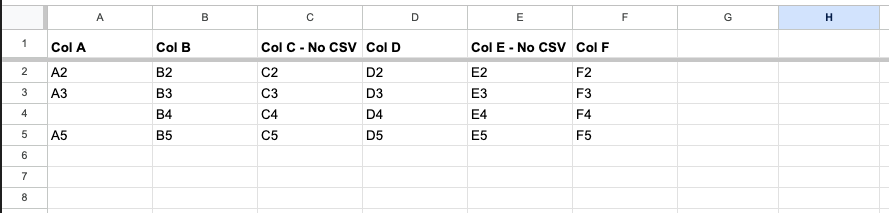
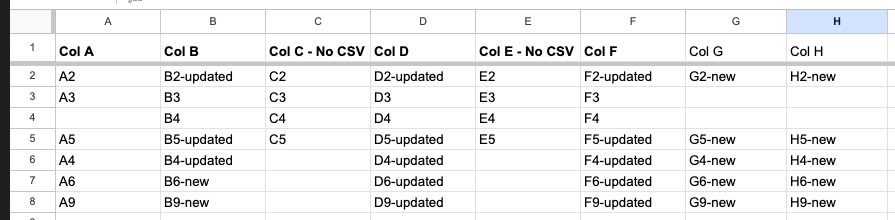

<!-- markdownlint-disable MD041 -->
<p align="center">
  
  <h2 align="center">CSV to Google Sheets</h2>
  <p align="center">Upload CSV data to Google Sheet</p>
</p>

---

<div align="center">

[](https://github.com/super-linter/super-linter)

[](https://github.com/fgerthoffert/actions-csv-to-gsheet/actions/workflows/check-dist.yml)
[](https://github.com/fgerthoffert/actions-csv-to-gsheet/actions/workflows/codeql-analysis.yml)
[](./badges/coverage.svg)

</div>

---

# About

Initially built to be used in conjuction with the
[actions-get-org-repos](https://github.com/Fgerthoffert/actions-get-org-repos)
GitHub Action.

This action takes data from a CSV and adds it to an existing Worksheet in a
Google Sheets. It is compatible with sheets already containing data and can
handle additional columns (for example to annotate data coming from the CSV).

It supports the following features:

- Creates missing headers (and therefore adds columns).
- Matches an identifier in the sheet to an identifier in the CSV. Based on that
  ID, determines if a row needs to be added or updated.
- Does not overwrite existing rows or existing columns
- Supports any valid CSV containiner a header and any content in the Google
  Sheet (as long as it contains a header row)

## Sample

Starting with the following sheet:



And submitting the following CSV file:

```csv
"Col A","Col B","Col D","Col F","Col G","Col H"
"A2","B2-updated","D2-updated","F2-updated","G2-new","H2-new"
"A4","B4-updated","D4-updated","F4-updated","G4-new","H4-new"
"A5","B5-updated","D5-updated","F5-updated","G5-new","H5-new"
"A6","B6-new","D6-updated","F6-updated","G6-new","H6-new"
"A9","B9-new","D9-updated","F9-updated","G9-new","H9-new"
```

With `gsheet_title_key` parameter set to "Col A".

Results in the following updated sheet:



You will notice the following:

- Two new columns were added (Col G and Col H)
- A3 rows was unmodified, since there's no row in the CSV containing key "A3" in
  "Col A".
- The empty row in line 4 was unmodified, since there's no row in the CSV
  containing an empty key.
- A4, A6 and A9 were created, Col C and Col E were left empty since not present
  in the CSV
- New row are added at the bottom of the spreadsheet (next empty row)

# :gear: Configuration

## Google Authentication

To use the action you will need to make it possible to authenticate with google.

- Login to [google API console](https://console.cloud.google.com/)
- In library search and enable `Google Sheets API`
- In the credentials section, click on `Manage service account` and click on
  `+ Create Service Account`
- Download the credentials file generated at previous step and use client_email
  and private_key as a secrets in your repository (you will need to base64
  encode the private key)
- Then open the spreadsheet you want to use, and add the client_email with an
  "Editor" role

## Input Parameters

The following input parameters are available:

| Parameter              | Default | Description                                                                                                                                                           |
| ---------------------- | ------- | --------------------------------------------------------------------------------------------------------------------------------------------------------------------- |
| csv_filepath           |         | Full filepath to the CSV file                                                                                                                                         |
| gsheet_auth_email      |         | Google Auth Email                                                                                                                                                     |
| gsheet_auth_pkey       |         | Google Auth private key, encoded as a base64 string                                                                                                                   |
| gsheet_id              |         | ID of the google sheet, you can find it in the URL                                                                                                                    |
| gsheet_worksheet_title |         | Title of the worksheet to update. If multiple worksheets have the same title, it will take the first one                                                              |
| gsheet_header_row      | 1       | Row number containing headers. This is important this is the row updated with extra column coming from the CSV and used for the ID match (gsheet_title_key parameter) |
| gsheet_title_key       | Name    | In the header row, title to be used as a key to match with the CSV data. This value must also be present in the CSV header                                            |
| gsheet_url             |         | Public URL of the Google Sheet. This is only for display purposes                                                                                                     |

## Outputs

The following outputs are available:

| Name       | Description                    |
| ---------- | ------------------------------ |
| gsheet_url | Public URL of the Google Sheet |

# :rocket: Usage

Sample workflow,

```yaml
name: Fetch Orgs Repos

on:
  workflow_dispatch:

jobs:
  get-org-repos:
    runs-on: ubuntu-latest
    steps:
      - name: Create Release Notes
        # Replace main by the release of your choice
        uses: fgerthoffert/actions-csv-to-gsheet@main
        with:
          csv_filepath: /path/to/your.csv
          gsheet_auth_email: jdoe@jdoe.iam.gserviceaccount.com
          gsheet_auth_pkey: ${{ secrets.BASE64_PRIVATE_KEY }}
          gsheet_id: 1OPVGYG5FgYXYeqQlpER07Ec9AQAO2QhtZ_2DNzmYBqQ
          gsheet_worksheet_title: Sheet1
          gsheet_header_row: 1
          gsheet_title_key: Name
          gsheet_url: https://docs.google.com/spreadsheets/d/1OPVGYG5FgYXYeqQlpER07Ec9AQAO2QhtZ_2DNzmYBqQ/edit?gid=0#gid=0
```

# How to contribute

- Fork the repository
- npm install
- Rename .env.example into .env
- Update the INPUT\_ variables
- Do your changes
- npx local-action . src/main.ts .env
- npm run bundle
- npm test
- PR into this repository, detailing your changes

More details about GitHub TypeScript action are
[available here](https://github.com/actions/typescript-action)
